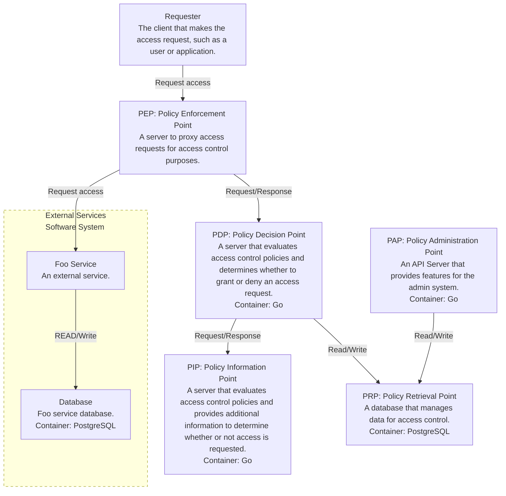
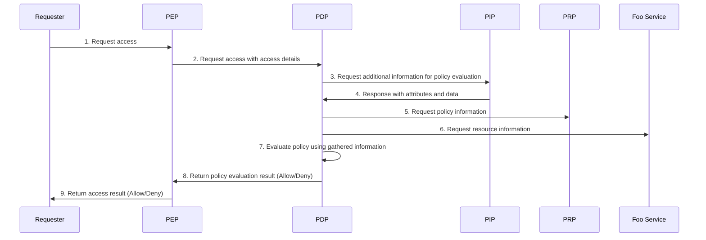

# poc-opa-access-control-system
This is a repository for POC of access control infrastructure using open policy agent.

# Get Started
## Prerequisites
- Docker
- Docker Compose
- Go
- Make

## Installation and Setup
1. Clone the repository.
`git clone git@github.com:bmf-san/poc-opa-access-control-system.git`

2. Initialize the Go Workspace.
`make init`

3. Start the Docker Containers.
`make docker-compose-up`

Add the following to your hosts file.

`/etc/hosts/`
```sh
127.0.0.1 foo.local
127.0.0.1 pdp.local
127.0.0.1 pep.local
127.0.0.1 pip.local
```

You can access the following services.

- Foo Service
  - [http://foo.local:8080](http://foo.local:8080)
- PDP
  - [http://pdp.local:8081](http://pdp.local:8081)
- PEP
  - [http://pep.local](http://pep.local)
- PIP
  - [http://pip.local:8082](http://pip.local:8082)

Because no virtual hosts correspondence is specified, a port specification is required.

4. Run Tests.
`make test`

5. Stop the Docker Containers.
`make docker-compose-down`

## Example of Access Control
We will validate the access control scenarios in a system assumed to be a SaaS for HR operations.

### Role-Based Access Control (RBAC)
#### Use Case: Managing Employee Access to Company Resources
**Scenario:**
- A company has employees with different roles: "Admin," "Manager," and "Employee."
- "Admins" can manage users and set permissions.
- "Managers" can approve requests but cannot modify permissions.
- "Employees" can only access their own profile.

**Implementation Approach:**
1. Retrieve the user's role from the database (`user_roles` table).
2. Fetch permissions linked to the role (`role_permissions` table).
3. Pass the request data along with the user's roles and permissions to OPA.
4. OPA evaluates the policies and determines whether the request is allowed.
5. Return the access decision in the API response.

**Example Request:**
<!-- TODO: example script -->
`curl -X GET http://foo.local/users -H "X-User-ID: user123"`

### Relationship-Based Access Control (ReBAC)
#### Use Case: Document Collaboration
**Scenario:**
- A system allows users to share documents with different permissions: "Owner," "Editor," and "Viewer."
- "Owners" can modify, delete, and share the document.
- "Editors" can modify the document but not delete or share it.
- "Viewers" can only read the document.

**Implementation Approach:**
1. Retrieve the relationships between users and documents (`relationships` table).
2. Identify the user's relation to the document ("owner," "editor," or "viewer").
3. Pass the request data along with the relationship information to OPA.
4. OPA evaluates the policies and determines access based on relationships.
5. Return the decision in the API response.

**Example Request:**
<!-- TODO: example script -->
`curl -X GET http://foo.local/users -H "X-User-ID: user123"`

### Attribute-Based Access Control (ABAC)
#### Use Case: Access Control Based on Employee Attributes
**Scenario:**
- A system restricts salary information access based on employment type and department.
- Employees can only view their own salary.
- Managers can view the salary details of employees in their department.
- HR personnel can view all salary information.

**Implementation Approach:**
1. Retrieve user attributes (department, employment type) from the database (`users` table).
2. Fetch applicable ABAC policies (`abac_policies` table) that match the request.
3. Pass request data, user attributes, and policies to OPA.
4. OPA evaluates policies and makes an access decision.
5. Return the access decision in the API response.

**Example Request:**
<!-- TODO: example script -->
`curl -X GET http://foo.local/users -H "X-User-ID: user123"`

### Multi role-based access control
<!-- TODO: -->

### View your own permission settings
<!-- TODO: -->

### Reverse lookup of authority control
<!-- TODO: Who has permission to see me? -->

# System Architecture
## C4 Model Container Diagram


All access requests from clients are configured to be proxied by the PEP.

Access requests are subject to access control via the PEP.

The PDP implements access control logic using the Open Policy Agent.

## Sequence Diagram
### Request access to the Foo service
It is assumed that the user has already been authenticated at the time of request.
In practice, I think it is necessary to design and implement the application with authentication in mind.

This sequence is common to RBAC, ReBAC, and ABAC use cases.



1. Access Request Initiation: The requester (user or application) sends an access request to the PEP.

2. PEP Requests Policy Evaluation: The PEP sends an access request to the PDP with access details (e.g., user information and resource information). The PDP performs policy evaluation based on this information.

3. Request Additional Information from PIP: The PDP requests additional information (e.g., user attributes and resource information) from the PIP for policy evaluation.

4. PIP Responds with Attributes and Data: The PIP returns information (e.g., user role and resource status) to the PDP for policy evaluation.

5. Request Policy Information from PRP: The PDP sends a request to the PRP to obtain policy information (e.g., rules related to access control). By obtaining the policy before requesting resource information from the Foo service, if there is a problem with the policy retrieval or the retrieved result, the process can be completed without requesting resource information, which is efficient.

6. Evaluate Policy Using Gathered Information: The PDP evaluates the policy based on the information obtained from the PIP and PRP. Based on the result of this evaluation, it is decided whether access is allowed or not.

7. Return Policy Evaluation Result to PEP: The PDP returns the policy evaluation result (allow or deny) to the PEP. The PEP decides whether to allow access based on this result.

8. Return Access Result to Requester: The PEP returns the access result (allow or deny) to the requester (user or application).

9. Request Resource Information from Foo Service (if Allowed): If access is allowed, the PEP requests resource information from the Foo service. This happens after resource access has been allowed.

There are some differences in the processing flows of RBAC, ReBAC, and ABAC.
Comparing the processing flows, they are as follows:

| Comparison Criteria           | RBAC (Role-Based)                        | ReBAC (Relationship-Based)                  | ABAC (Attribute-Based)                             |
| ----------------------------- | ---------------------------------------- | ------------------------------------------- | -------------------------------------------------- |
| **Control Basis**             | User roles                               | User-resource relationships                 | User and resource attributes                       |
| **Information from PIP**      | User role information                    | User-resource relationship data             | User attributes, resource attributes               |
| **Policy Evaluation**         | Checking role-based permissions          | Checking permissions based on relationships | Checking permissions based on attribute conditions |
| **Dynamic Processing**        | Relatively static                        | Dynamic (adapts to relationship changes)    | Highly dynamic (varied attribute conditions)       |
| **PDP Evaluation Load**       | Low                                      | Medium                                      | High                                               |
| **Implementation Complexity** | Easy                                     | Moderate                                    | Complex                                            |

## Database Schema
### Policy Retrieval Point (PRP)
See [docs/db/prp](https://github.com/bmf-san/poc-opa-access-control-system/tree/main/docs/db/prp)

### Foo Service
See [docs/db/foo](https://github.com/bmf-san/poc-opa-access-control-system/tree/main/docs/db/foo)

# Contribution
Issues and Pull Requests are always welcome.

We would be happy to receive your contributions.

Please review the following documents before making a contribution.

- [CODE_OF_CONDUCT](https://github.com/bmf-san/poc-opa-access-control-system/blob/master/.github/CODE_OF_CONDUCT.md)
- [CONTRIBUTING](https://github.com/bmf-san/poc-opa-access-control-system/blob/master/.github/CONTRIBUTING.md)

# References
- [Open Policy Agent](https://www.openpolicyagent.org/)

# License
Based on the MIT License.

[LICENSE](https://github.com/bmf-san/poc-opa-access-control-system/blob/master/LICENSE)

# Author
[bmf-san](https://github.com/bmf-san)

- Email
  - bmf.infomation@gmail.com
- Blog
  - [bmf-tech.com](http://bmf-tech.com)
- Twitter
  - [bmf-san](https://twitter.com/bmf-san)
