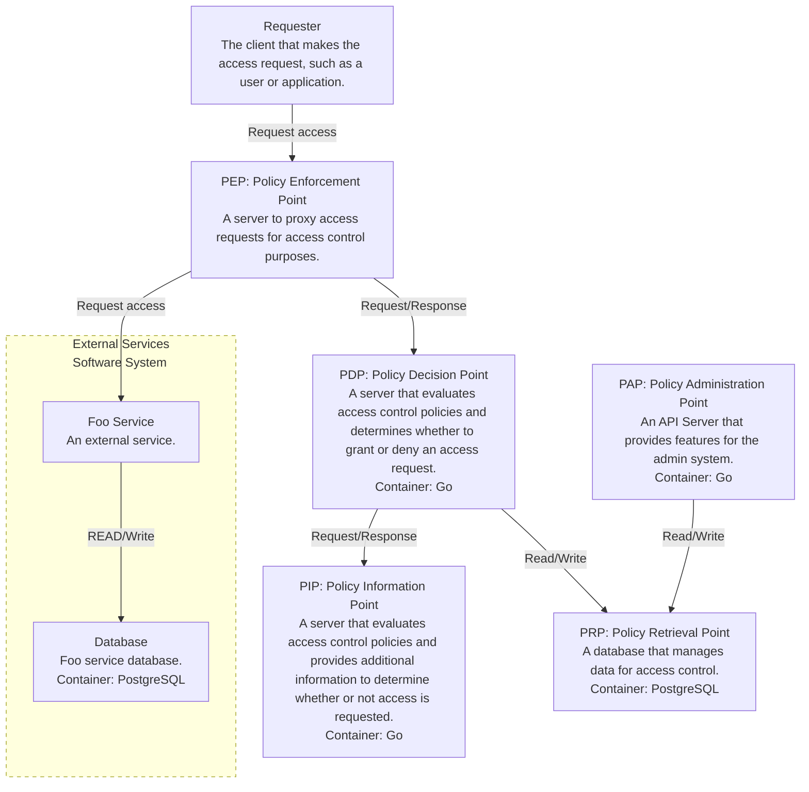
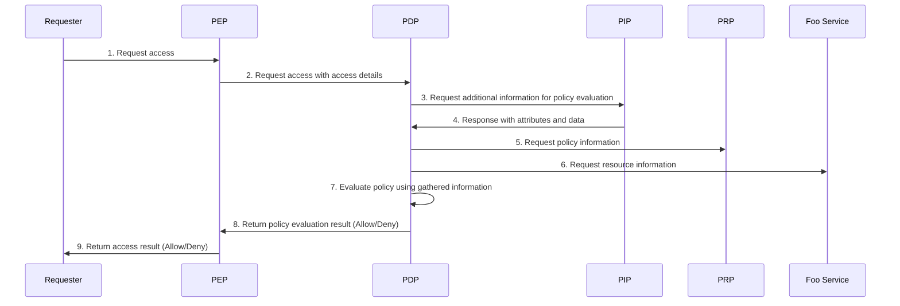

# poc-opa-access-control-system
This is a repository for POC of access control infrastructure using open policy agent.

# System Architecture
## C4 Model Container Diagram

All access requests from clients are configured to be proxied by the PEP.

Access requests are subject to access control via the PEP.

The PDP implements access control logic using the Open Policy Agent.

## Sequence Diagram
### Request access to the Foo service
It is assumed that the user has been authenticated at the source of the access request.

1. Access Request Initiation: The requester (user or application) sends an access request to the PEP.

2. PEP Requests Policy Evaluation: The PEP sends an access request to the PDP with access details (e.g., user information and resource information). The PDP performs policy evaluation based on this information.

3. Request Additional Information from PIP: The PDP requests additional information (e.g., user attributes and resource information) from the PIP for policy evaluation.

4. PIP Responds with Attributes and Data: The PIP returns information (e.g., user role and resource status) to the PDP for policy evaluation.

5. Request Policy Information from PRP: The PDP sends a request to the PRP to obtain policy information (e.g., rules related to access control). By obtaining the policy before requesting resource information from the Foo service, if there is a problem with the policy retrieval or the retrieved result, the process can be completed without requesting resource information, which is efficient.

6. Evaluate Policy Using Gathered Information: The PDP evaluates the policy based on the information obtained from the PIP and PRP. Based on the result of this evaluation, it is decided whether access is allowed or not.
7. Return Policy Evaluation Result to PEP: The PDP returns the policy evaluation result (allow or deny) to the PEP. The PEP decides whether to allow access based on this result.
8. Return Access Result to Requester: The PEP returns the access result (allow or deny) to the requester (user or application).
9. Request Resource Information from Foo Service (if Allowed): If access is allowed, the PEP requests resource information from the Foo service. This happens after resource access has been allowed.

## Database Schema
### Policy Retrieval Point (PRP)
// TBD:

### Foo Service
| Column Name | Data Type | Description |
|-------------|-----------|-------------|
| id          | UUID      | A unique identifier for the resource (primary key). |
| name        | TEXT      | The name of the resource. |
| created_at  | TIMESTAMP | The creation date and time of the resource. |
| updated_at  | TIMESTAMP | The last update date and time of the resource. |

# Contribution
Issues and Pull Requests are always welcome.

We would be happy to receive your contributions.

Please review the following documents before making a contribution.

- [CODE_OF_CONDUCT](https://github.com/bmf-san/poc-opa-access-control-system/blob/master/.github/CODE_OF_CONDUCT.md)
- [CONTRIBUTING](https://github.com/bmf-san/poc-opa-access-control-system/blob/master/.github/CONTRIBUTING.md)

# References
- [Open Policy Agent](https://www.openpolicyagent.org/)

# License
Based on the MIT License.

[LICENSE](https://github.com/bmf-san/poc-opa-access-control-system/blob/master/LICENSE)

# Author
[bmf-san](https://github.com/bmf-san)

- Email
  - bmf.infomation@gmail.com
- Blog
  - [bmf-tech.com](http://bmf-tech.com)
- Twitter
  - [bmf-san](https://twitter.com/bmf-san)
