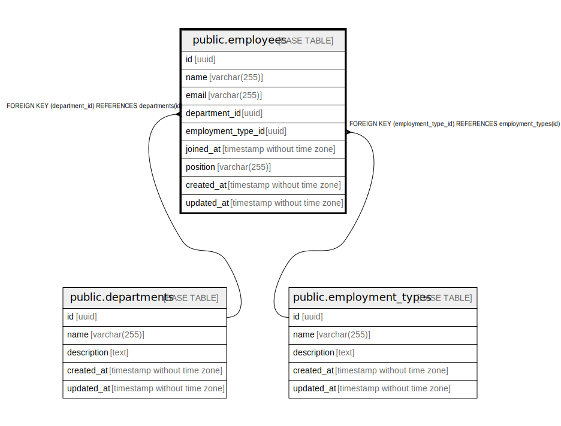

# public.employees

## Description

## Columns

| Name | Type | Default | Nullable | Children | Parents | Comment |
| ---- | ---- | ------- | -------- | -------- | ------- | ------- |
| id | uuid |  | false |  |  |  |
| name | varchar(255) |  | false |  |  |  |
| email | varchar(255) |  | false |  |  |  |
| department_id | uuid |  | false |  | [public.departments](public.departments.md) |  |
| employment_type_id | uuid |  | false |  | [public.employment_types](public.employment_types.md) |  |
| joined_at | timestamp without time zone | CURRENT_TIMESTAMP | false |  |  |  |
| position | varchar(255) |  | false |  |  |  |
| created_at | timestamp without time zone | CURRENT_TIMESTAMP | false |  |  |  |
| updated_at | timestamp without time zone | CURRENT_TIMESTAMP | false |  |  |  |

## Constraints

| Name | Type | Definition |
| ---- | ---- | ---------- |
| employees_department_id_fkey | FOREIGN KEY | FOREIGN KEY (department_id) REFERENCES departments(id) |
| employees_employment_type_id_fkey | FOREIGN KEY | FOREIGN KEY (employment_type_id) REFERENCES employment_types(id) |
| employees_pkey | PRIMARY KEY | PRIMARY KEY (id) |

## Indexes

| Name | Definition |
| ---- | ---------- |
| employees_pkey | CREATE UNIQUE INDEX employees_pkey ON public.employees USING btree (id) |

## Relations

---

> Generated by [tbls](https://github.com/k1LoW/tbls)
