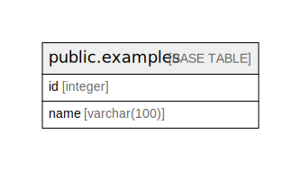

# foo

## Tables

| Name | Columns | Comment | Type |
| ---- | ------- | ------- | ---- |
| [public.examples](public.examples.md) | 2 |  | BASE TABLE |

## Relations

---

> Generated by [tbls](https://github.com/k1LoW/tbls)
