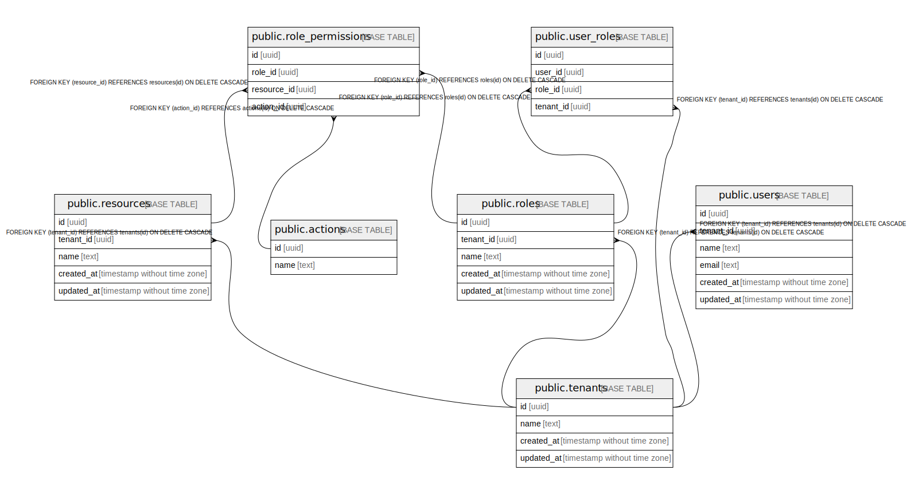

# prp

## Tables

| Name | Columns | Comment | Type |
| ---- | ------- | ------- | ---- |
| [public.tenants](public.tenants.md) | 4 |  | BASE TABLE |
| [public.departments](public.departments.md) | 5 |  | BASE TABLE |
| [public.employment_types](public.employment_types.md) | 5 |  | BASE TABLE |
| [public.resources](public.resources.md) | 5 |  | BASE TABLE |
| [public.actions](public.actions.md) | 2 |  | BASE TABLE |
| [public.roles](public.roles.md) | 5 |  | BASE TABLE |
| [public.attributes](public.attributes.md) | 5 |  | BASE TABLE |
| [public.users](public.users.md) | 8 |  | BASE TABLE |
| [public.role_permissions](public.role_permissions.md) | 4 |  | BASE TABLE |
| [public.user_roles](public.user_roles.md) | 4 |  | BASE TABLE |
| [public.abac_policies](public.abac_policies.md) | 8 |  | BASE TABLE |
| [public.relationships](public.relationships.md) | 5 |  | BASE TABLE |

## Relations

---

> Generated by [tbls](https://github.com/k1LoW/tbls)
