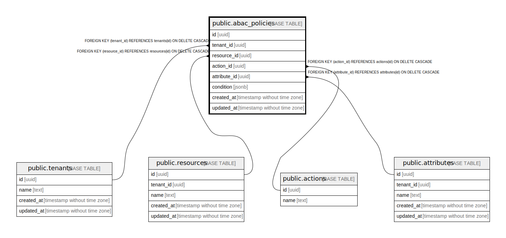

# public.abac_policies

## Description

## Columns

| Name | Type | Default | Nullable | Children | Parents | Comment |
| ---- | ---- | ------- | -------- | -------- | ------- | ------- |
| id | uuid |  | false |  |  |  |
| tenant_id | uuid |  | false |  | [public.tenants](public.tenants.md) |  |
| resource_id | uuid |  | false |  | [public.resources](public.resources.md) |  |
| action_id | uuid |  | false |  | [public.actions](public.actions.md) |  |
| attribute_id | uuid |  | false |  | [public.attributes](public.attributes.md) |  |
| condition | jsonb |  | false |  |  |  |
| created_at | timestamp without time zone | CURRENT_TIMESTAMP | true |  |  |  |
| updated_at | timestamp without time zone | CURRENT_TIMESTAMP | true |  |  |  |

## Constraints

| Name | Type | Definition |
| ---- | ---- | ---------- |
| abac_policies_tenant_id_fkey | FOREIGN KEY | FOREIGN KEY (tenant_id) REFERENCES tenants(id) ON DELETE CASCADE |
| abac_policies_resource_id_fkey | FOREIGN KEY | FOREIGN KEY (resource_id) REFERENCES resources(id) ON DELETE CASCADE |
| abac_policies_action_id_fkey | FOREIGN KEY | FOREIGN KEY (action_id) REFERENCES actions(id) ON DELETE CASCADE |
| abac_policies_attribute_id_fkey | FOREIGN KEY | FOREIGN KEY (attribute_id) REFERENCES attributes(id) ON DELETE CASCADE |
| abac_policies_pkey | PRIMARY KEY | PRIMARY KEY (id) |

## Indexes

| Name | Definition |
| ---- | ---------- |
| abac_policies_pkey | CREATE UNIQUE INDEX abac_policies_pkey ON public.abac_policies USING btree (id) |

## Relations

---

> Generated by [tbls](https://github.com/k1LoW/tbls)
