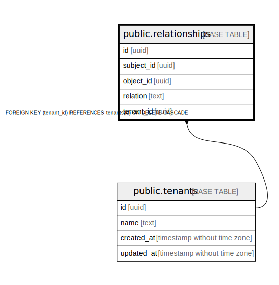

# public.relationships

## Description

## Columns

| Name | Type | Default | Nullable | Children | Parents | Comment |
| ---- | ---- | ------- | -------- | -------- | ------- | ------- |
| id | uuid |  | false |  |  |  |
| subject_id | uuid |  | false |  |  |  |
| object_id | uuid |  | false |  |  |  |
| relation | text |  | false |  |  |  |
| tenant_id | uuid |  | false |  | [public.tenants](public.tenants.md) |  |

## Constraints

| Name | Type | Definition |
| ---- | ---- | ---------- |
| relationships_tenant_id_fkey | FOREIGN KEY | FOREIGN KEY (tenant_id) REFERENCES tenants(id) ON DELETE CASCADE |
| relationships_pkey | PRIMARY KEY | PRIMARY KEY (id) |

## Indexes

| Name | Definition |
| ---- | ---------- |
| relationships_pkey | CREATE UNIQUE INDEX relationships_pkey ON public.relationships USING btree (id) |

## Relations

---

> Generated by [tbls](https://github.com/k1LoW/tbls)
