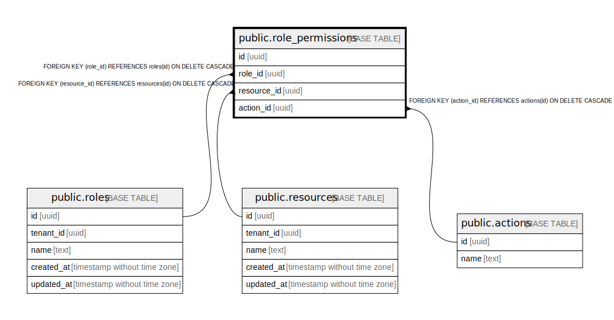

# public.role_permissions

## Description

## Columns

| Name | Type | Default | Nullable | Children | Parents | Comment |
| ---- | ---- | ------- | -------- | -------- | ------- | ------- |
| id | uuid |  | false |  |  |  |
| role_id | uuid |  | false |  | [public.roles](public.roles.md) |  |
| resource_id | uuid |  | false |  | [public.resources](public.resources.md) |  |
| action_id | uuid |  | false |  | [public.actions](public.actions.md) |  |

## Constraints

| Name | Type | Definition |
| ---- | ---- | ---------- |
| role_permissions_resource_id_fkey | FOREIGN KEY | FOREIGN KEY (resource_id) REFERENCES resources(id) ON DELETE CASCADE |
| role_permissions_action_id_fkey | FOREIGN KEY | FOREIGN KEY (action_id) REFERENCES actions(id) ON DELETE CASCADE |
| role_permissions_role_id_fkey | FOREIGN KEY | FOREIGN KEY (role_id) REFERENCES roles(id) ON DELETE CASCADE |
| role_permissions_pkey | PRIMARY KEY | PRIMARY KEY (id) |

## Indexes

| Name | Definition |
| ---- | ---------- |
| role_permissions_pkey | CREATE UNIQUE INDEX role_permissions_pkey ON public.role_permissions USING btree (id) |

## Relations

---

> Generated by [tbls](https://github.com/k1LoW/tbls)
