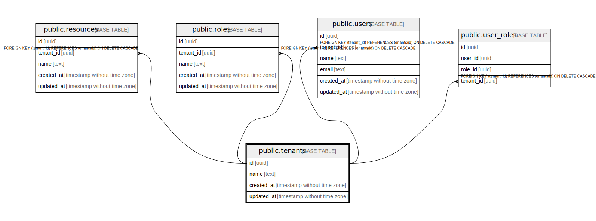

# public.tenants

## Description

## Columns

| Name | Type | Default | Nullable | Children | Parents | Comment |
| ---- | ---- | ------- | -------- | -------- | ------- | ------- |
| id | uuid |  | false | [public.departments](public.departments.md) [public.employment_types](public.employment_types.md) [public.resources](public.resources.md) [public.roles](public.roles.md) [public.attributes](public.attributes.md) [public.users](public.users.md) [public.user_roles](public.user_roles.md) [public.abac_policies](public.abac_policies.md) [public.relationships](public.relationships.md) |  |  |
| name | text |  | false |  |  |  |
| created_at | timestamp without time zone | CURRENT_TIMESTAMP | true |  |  |  |
| updated_at | timestamp without time zone | CURRENT_TIMESTAMP | true |  |  |  |

## Constraints

| Name | Type | Definition |
| ---- | ---- | ---------- |
| tenants_pkey | PRIMARY KEY | PRIMARY KEY (id) |

## Indexes

| Name | Definition |
| ---- | ---------- |
| tenants_pkey | CREATE UNIQUE INDEX tenants_pkey ON public.tenants USING btree (id) |

## Relations

---

> Generated by [tbls](https://github.com/k1LoW/tbls)
