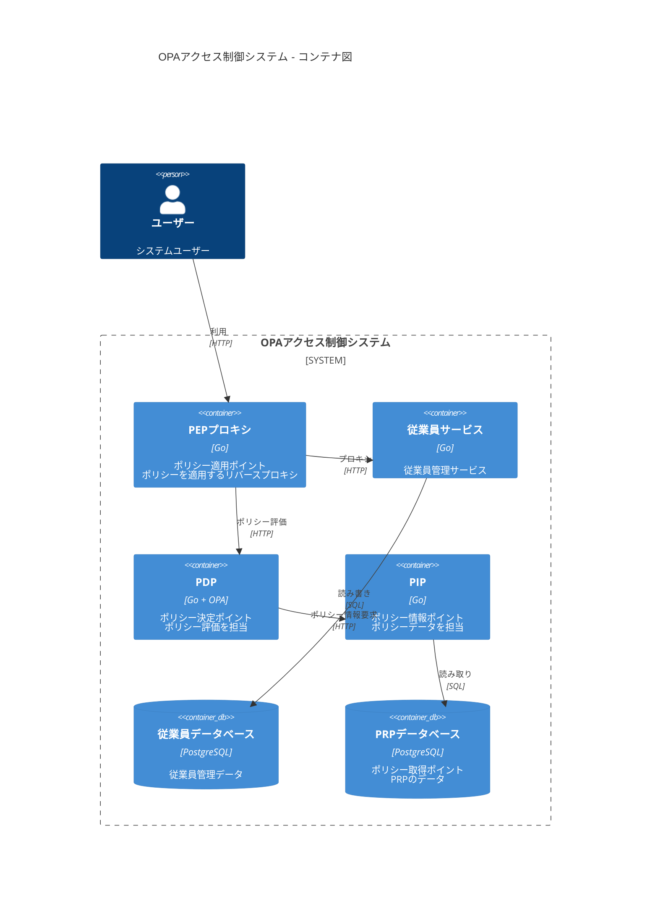
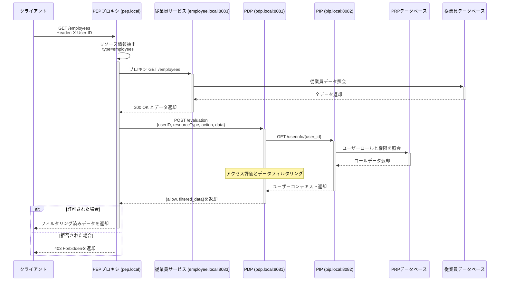

# アクセス制御システム 設計ドキュメント

## 1. 設計概要

本システムは、OPA (Open Policy Agent) フレームワークを使用した堅牢なアクセス制御アーキテクチャを実装しています。システムは以下の主要なコンポーネントで構成されています：

1. Policy Enforcement Point (PEP) - リクエストを傍受しPDPに問い合わせを行うリバースプロキシ
2. Policy Decision Point (PDP) - OPAを使用してポリシーに対してアクセス要求を評価
3. Policy Information Point (PIP) - ポリシー決定に必要なコンテキスト情報を提供
4. Policy Retrieval Point (PRP) - ロールや権限を含むポリシー関連データを保存
5. 従業員サービス - アクセス制御システムによって保護される従業員管理サービス

本システムは以下の特徴を持つロールベースアクセス制御（RBAC）を実装しています：
- ユーザーにロール（マネージャー、従業員など）を割り当て
- ロールにリソースに対するアクション権限を付与
- PDPがOPAポリシーを使用してアクセス判断とフィールドレベルのフィルタリングを実施
- 一貫したアクセス制御のためにポリシーレイヤーでレスポンスデータをフィルタリング

## 2. アクセス制御アーキテクチャ

### 2.1 アーキテクチャ概要

本システムは、以下の主要なコンポーネントで構成される分散アクセス制御アーキテクチャを採用しています：

#### Policy Enforcement Point (PEP)
リバースプロキシとして機能し、すべてのリクエストをインターセプトしてアクセス制御を実施します。

主な責務：
- すべての着信リクエストの傍受
- リクエストからのユーザーコンテキストの抽出
- PDPへのアクセス判断の要求
- レスポンスデータのフィルタリング適用

#### Policy Decision Point (PDP)
Open Policy Agent (OPA) を使用してポリシー評価を行います。

主な責務：
- アクセスポリシーの評価
- フィールドレベルのアクセス制御判断
- レスポンスデータのフィルタリングルール適用
- PIPとの連携によるコンテキスト情報の取得

#### Policy Information Point (PIP)
ポリシー判断に必要な補足情報を提供します。

主な責務：
- ユーザー情報の提供
- ロール情報の提供
- 組織構造情報の提供
- その他のコンテキスト情報の提供

#### Policy Retrieval Point (PRP)
ポリシー関連データを永続化します。

主な責務：
- ポリシーデータの保存
- ロールと権限のマッピング管理
- ユーザーとロールの関連付け
- ポリシー設定の永続化

### 2.2 C4コンテナ図



## 3. アクセス制御モデル

本システムは以下のアクセス制御モデルを実装しています：

### 3.1 ロールベースアクセス制御（RBAC）

1. 基本概念
   - ユーザーにロールを割り当て
   - ロールに権限を付与
   - 権限によってリソースへのアクセスを制御

2. 主な特徴
   - ロールによる権限の集中管理
   - 権限の継承と階層構造
   - ユーザーとロールの多対多関係
   - ロール間の権限継承

### 3.2 フィールドレベルアクセス制御

1. 基本概念
   - レスポンスデータの各フィールドに対するアクセス制御
   - ロールに基づくフィールドの可視性制御
   - 動的なデータフィルタリング

2. 主な特徴
   - きめ細かなデータアクセス制御
   - 動的なフィールドマスキング
   - コンテキストに基づくフィルタリング
   - 一貫したデータ保護

## 4. コンポーネントの責務

### 4.1 Policy Enforcement Point (PEP)

#### 4.1.1 責務
- クライアントと従業員サービス間のリバースプロキシとして機能
- すべての受信リクエストを傍受
- リクエストからユーザーとリソース情報を抽出
- アクセス判断とフィルタリングのためにデータをPDPに転送
- PDPでフィルタリングされたレスポンスデータを使用
- アクセス拒否時にHTTP 403 Forbiddenを返却

### 4.2 Policy Decision Point (PDP)

#### 4.2.1 責務
- RBACモデルを使用してポリシーに対してアクセス要求を評価
- ポリシー評価とデータフィルタリングにOPAを使用
- PIPから追加情報を要求
- アクセス判断とフィルタリング済みレスポンスデータを返却
- ポリシールールを通じた一貫したフィールドレベルのアクセス制御を保証

### 4.3 Policy Information Point (PIP)

#### 4.3.1 責務
- ユーザー情報の取得
- ロールと権限データの照会
- PDPへの意思決定データの提供

### 4.4 Policy Retrieval Point (PRP)

#### 4.4.1 責務
- アクセス制御データ（ロール、権限、ユーザー）の保存
- ポリシー関連情報の管理
- アクセス制御エンティティの永続化を提供
- ユーザーロール割り当てとロール権限マッピングの維持

### 4.5 従業員サービス

#### 4.5.1 責務
- 従業員情報管理機能の提供
- コアビジネスロジックとデータ操作に注力
- 従業員データ管理用のRESTful APIを提供
- 従業員データ、部門関係、雇用形態の管理
- すべてのアクセス制御はPEPプロキシで処理

## 5. ポリシー実装

### 5.1 Policy as Code

1. Regoポリシー言語
   - 宣言的なポリシー記述
   - パターンマッチングと評価ルール
   - 再利用可能なモジュール化
   - テスト容易性

2. ポリシー構造
   - リソースタイプごとのポリシー
   - アクション別の評価ルール
   - フィールドレベルのフィルタリングルール
   - デフォルトの拒否ルール

### 5.2 ポリシー評価フロー



## 6. API仕様

### 6.1 PEPエンドポイント (pep.local)

PEPはリバースプロキシとして以下のエンドポイントをサポートします：

#### /health
- **メソッド**: GET
- **説明**: ヘルスチェックエンドポイント
- **レスポンス**: 200 OK
- **備考**: アクセス制御の対象外

#### 基本設定
- **サービスアドレス**: pep.local (ポート80)
- **サポートメソッド**: GETのみ (view アクション用)
- **必須ヘッダー**:
  - `X-User-ID`: string (必須) - ユーザー識別子
- **共通エラーレスポンス**:
  - 400: Bad Request - X-User-IDヘッダー不足
  - 403: Forbidden - ポリシーによるアクセス拒否
  - 405: Method Not Allowed - GETメソッドのみサポート
  - 500: Internal Server Error

#### 利用可能なエンドポイント

##### 1. ヘルスチェック
- **パス**: /health
- **メソッド**: GET
- **説明**: シンプルなヘルスチェックエンドポイント
- **備考**: ポリシー評価をバイパスし、バックエンドに直接転送

##### 2. 動的リソースアクセス
PEPは以下の方法でリクエストを動的に処理します：
1. 最初のパスセグメントからリソースタイプを抽出
2. 2番目のパスセグメントからリソースIDを任意で抽出

例：
- `/employees` - 従業員コレクションへのアクセス

すべてのリソースリクエストは以下の処理を行います：
1. X-User-IDヘッダーによる認証
2. PDPによるポリシー評価
3. 許可されたフィールドに基づくレスポンスフィルタリング

#### 使用例
```bash
# 従業員一覧へのアクセス
curl -X GET http://pep.local/employees \
  -H "X-User-ID: 11111111-1111-1111-1111-111111111111"

# ヘルスチェック
curl -X GET http://pep.local/health
```

### 6.2 PDPエンドポイント (pdp.local:8081)

#### /evaluation
- **メソッド**: POST
- **説明**: ポリシー評価とデータフィルタリング用の内部エンドポイント
- **ヘッダー**:
  - `Content-Type`: application/json
- **リクエストボディ**:
```json
{
  "user_id": "string (UUID)",
  "resource_type": "string",
  "resource_id": "string",
  "action": "string",
  "data": "object (オプション)"
}
```
- **レスポンス**:
```json
{
  "allow": "boolean",
  "message": "string",
  "allowed_fields": ["string"],
  "filtered_data": "object (オプション)"
}
```
- **ロギング**:
  - ポリシー評価ステップ
  - PIPからのデータ取得
  - フィールドレベルのフィルタリング
  - レスポンス生成

### 6.3 PIPエンドポイント (pip.local:8082)

#### /users/{user_id}/roles
- **メソッド**: GET
- **説明**: RBAC用のユーザーロール取得
- **レスポンス**: ロールオブジェクトの配列

### 6.4 従業員サービスエンドポイント (employee.local:8083)

#### /employees
- **メソッド**: GET
- **説明**: アクセス可能な従業員の一覧を取得
- **ヘッダー**:
  - `X-User-ID`: string (必須)
- **レスポンス**:
```json
{
    "employees": [{
        "id": "string (UUID)",
        "name": "string",
        "email": "string",
        "department_id": "string (UUID)",
        "department_name": "string",
        "employment_type_id": "string (UUID)",
        "employment_type": "string",
        "position": "string",
        "joined_at": "string (ISO 8601)"
    }]
}
```

#### 例
```bash
# 従業員一覧の取得 (PEP経由)
curl -X GET http://pep.local/employees \
  -H "X-User-ID: 11111111-1111-1111-1111-111111111111"
```

## 7. データモデル

### 7.1 データベーススキーマ

#### PRPデータベース
ポリシー関連のテーブルを含みます：
- tenants: システム内の組織
- resources: 保護対象リソース
- actions: 利用可能なアクション（view, edit など）
- roles: ユーザーロール
- users: アクセス制御用のユーザー情報
- role_permissions: ロールに割り当てられた権限
- user_roles: ユーザーへのロール割り当て

#### 従業員データベース
ビジネスドメインのテーブルを含みます：
- departments: 部門情報
- employment_types: 雇用形態（正社員、パートタイムなど）
- employees: 部門と雇用形態の関係を持つ従業員レコード

## 8. OPA統合分析

### 8.1 OPAの利点

1. Policy as Code
   - 宣言的なRego言語でポリシーを記述
   - ポリシー変更のバージョン管理とレビュープロセス
   - ポリシーのテストと検証が容易
   - ポリシーユニットテストをサポート

2. 関心の分離
   - ビジネスロジックと認可ロジックの明確な分離
   - アプリケーションコードを変更せずにポリシーを更新可能
   - 集中的なポリシー管理
   - サービス間で一貫したポリシー適用

3. パフォーマンスとスケーラビリティ
   - 高性能なポリシー評価
   - ポリシーのプリコンパイル対応
   - ポリシー判断のキャッシュをサポート
   - 水平スケーラビリティ

4. 豊富なポリシー機能
   - きめ細かなアクセス制御
   - レスポンスデータのフィルタリング
   - 階層的なリソース構造
   - 複雑なポリシールールと条件

### 8.2 実装上の課題

1. 学習曲線
   - Rego言語の習得が必要
   - ポリシー記述の思考モデルが異なる
   - OPAの評価モデルの理解が必要
   - 複雑なポリシーのデバッグが困難

2. インフラストラクチャの複雑さ
   - 追加のサービス（PDP）の維持が必要
   - ポリシー配布の管理が必要
   - 適切な監視とロギングが必要
   - パフォーマンスチューニングが必要

3. ポリシー管理
   - ポリシーの同期を維持
   - バージョン管理とデプロイメント
   - ポリシーのテストカバレッジ
   - ドキュメンテーションの維持

### 8.3 設計上の考慮点

1. ポリシー構造
   - ドメインごとのポリシー整理
   - 明確な命名規則
   - 再利用可能なポリシーモジュール
   - 明確なインターフェース

2. パフォーマンス最適化
   - 効率的なポリシー評価パス
   - 適切なキャッシュ戦略
   - リソース使用率の監視
   - レスポンスタイムの考慮

3. エラー処理
   - 明確なエラーメッセージ
   - 適切なロギング
   - フォールバックポリシー
   - 監視とアラート

### 8.4 本プロジェクトでOPAを採用した理由

1. 要件との適合性
   - フィールドレベルのアクセス制御
   - ロールベースの権限
   - 動的なポリシー評価
   - データフィルタリング機能

2. 保守性
   - ポリシーとアプリケーションの明確な分離
   - アクセスルールの更新が容易
   - 充実したテストサポート
   - よく整備されたフレームワーク

3. 将来の拡張性
   - 複数のポリシータイプのサポート
   - 新しいリソースの追加が容易
   - 柔軟な権限モデル
   - 他のサービスとの統合

## 9. 運用設計

### 9.1 セキュリティ考慮事項

1. 最小権限の原則
   - 必要最小限の権限付与
   - 明示的な権限付与
   - デフォルトでの拒否
   - 定期的な権限レビュー

2. 運用セキュリティ
   - ポリシー変更の監査
   - アクセスログの記録
   - 異常検知と通知
   - 定期的なセキュリティレビュー

### 9.2 パフォーマンスとスケーラビリティ

1. 最適化ポイント
   - ポリシー評価の効率化
   - キャッシュ戦略
   - データベースアクセスの最適化
   - ネットワーク遅延の最小化

2. スケーラビリティ
   - 水平スケーリング
   - キャッシュ分散
   - 負荷分散
   - 障害回復

### 9.3 監視と運用

1. モニタリング
   - パフォーマンス指標
   - エラー率
   - レイテンシ
   - リソース使用率

2. 運用管理
   - ポリシー更新手順
   - バックアップと復旧
   - インシデント対応
   - キャパシティ管理

## 10. 今後の検討事項

### 10.1 セキュリティ強化

1. サービス間認証の実装
2. すべての通信にTLSを有効化
3. 監査ログの追加
4. ユーザー活動追跡用のアクセスログ実装
5. 暗号化と認証の適切な鍵管理の確保
6. 最小権限アクセス制御の実施

### 10.2 パフォーマンス改善

1. ポリシー判断用のキャッシュレイヤーの導入
2. データベースアクセスの最適化
3. プリコンパイル済みルールによるポリシー評価レイテンシーの削減

### 10.3 機能拡張

1. 動的ポリシー更新の導入
2. ポリシーバージョニングの実装
3. 専用のポリシーテスト環境の提供（開発者サンドボックス等）
4. UI ベースのポリシー管理機能の実装
5. 過去のポリシーバージョンへのロールバック機能
6. マルチロールサポートの実装
   - ユーザーごとの複数ロール割り当て
   - ロール競合の解決
   - ロールの階層と継承
   - 優先順位ベースのロール適用
7. 権限検索機能の追加
   - ユーザー権限の検索
   - リソースで利用可能なアクション
   - フィールドレベルのアクセス詳細
   - 権限継承ツリー
8. 権限設定情報管理の提供
   - 権限設定の概要
   - ロール権限マッピング
   - ユーザーロール割り当て
   - 視覚的な権限マッピングツール
