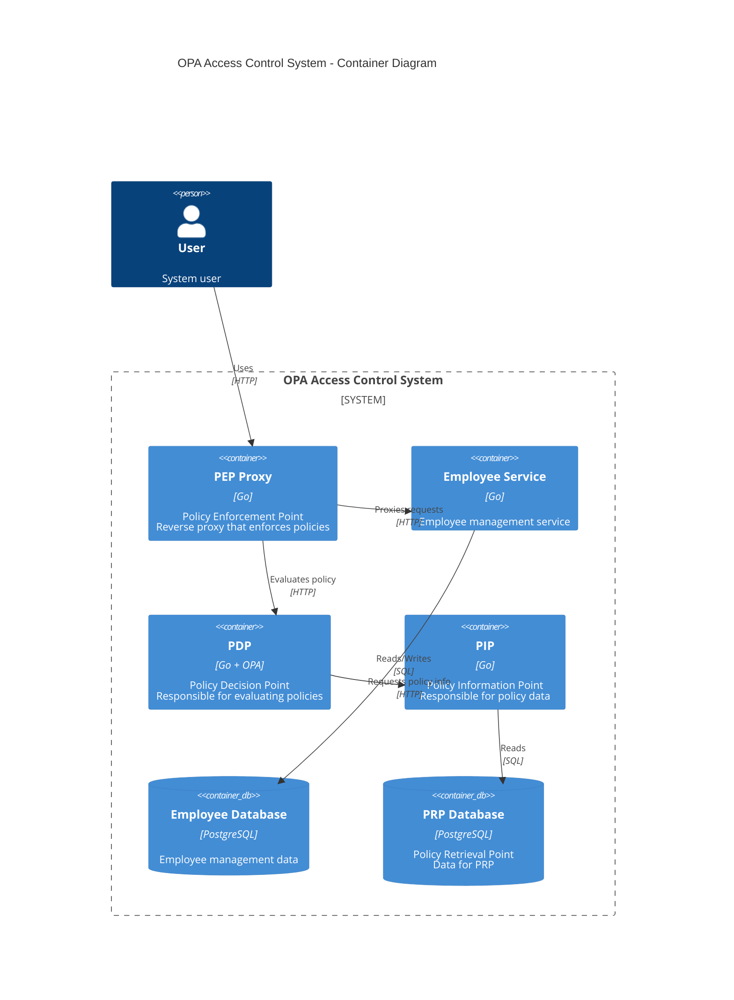
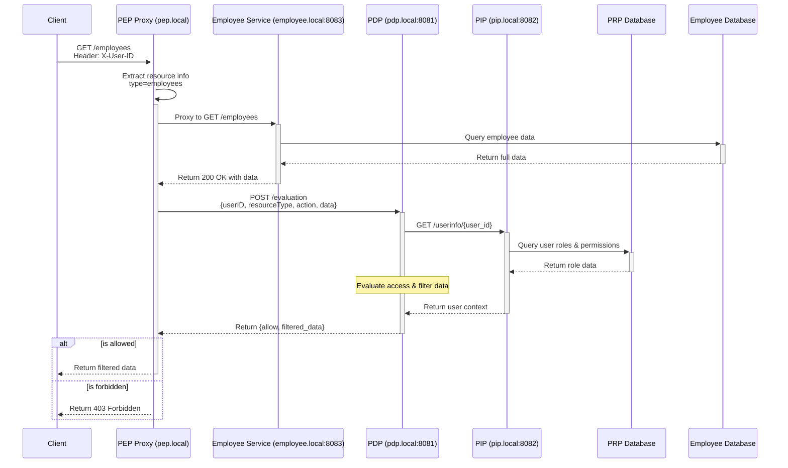

# Access Control System Design Document

## 1. Design Overview

This system implements a robust access control architecture using the OPA (Open Policy Agent) framework. The system consists of several key components:

1. Policy Enforcement Point (PEP) - A reverse proxy that enforces access control by intercepting requests and consulting with PDP
2. Policy Decision Point (PDP) - Uses OPA to evaluate access requests against defined policies
3. Policy Information Point (PIP) - Provides necessary context information for policy decisions
4. Policy Retrieval Point (PRP) - Stores policy-related data including roles and permissions
5. Employee Service - An employee management service protected by the access control system

The system implements Role-Based Access Control (RBAC) where:
- Users are assigned roles (e.g., manager, employee)
- Roles are granted permissions to perform actions on resources
- Access decisions and field-level filtering are handled by the PDP using OPA policies
- Response data filtering is performed in the policy layer for consistent access control

## 2. Architecture Design

### 2.1 C4 Container Diagram



## 3. Component Responsibilities

### 3.1 Policy Enforcement Point (PEP)

#### 3.1.1 Responsibilities
- Acts as a reverse proxy between clients and the Employee service
- Intercepts all incoming requests
- Extracts user and resource information from requests
- Forwards data to PDP for access decisions and filtering
- Uses PDP-filtered response data
- Returns HTTP 403 Forbidden for denied requests

### 3.2 Policy Decision Point (PDP)

#### 3.2.1 Responsibilities
- Evaluates access requests against policies using RBAC model
- Uses OPA for policy evaluation and data filtering
- Requests additional information from PIP
- Returns access decisions with filtered response data
- Ensures consistent field-level access control through policy rules

### 3.3 Policy Information Point (PIP)

#### 3.3.1 Responsibilities
- Retrieves user information
- Queries role and permission data
- Provides data to PDP for decision making

### 3.4 Policy Retrieval Point (PRP)

#### 3.4.1 Responsibilities
- Stores access control data (roles, permissions, users)
- Manages policy-related information
- Provides data persistence for access control entities
- Maintains user-role assignments and role-permission mappings

### 3.5 Employee Service

#### 3.5.1 Responsibilities
- Provides employee information management functionality
- Focuses on core business logic and data operations
- Provides RESTful API for employee data management
- Maintains employee data, department relationships, and employment types
- All access control is handled by the PEP proxy

## 4. Access Control Flow Diagrams



## 5 API Specifications

### 5.1 PEP Endpoints (pep.local)

The PEP acts as a reverse proxy and supports the following endpoints:

#### /health
- **Method**: GET
- **Description**: Health check endpoint
- **Response**: 200 OK
- **Notes**: Not subject to access control

#### Base Configuration
- **Service Address**: pep.local (port 80)
- **Supported Methods**: GET only (for view action)
- **Required Headers**:
  - `X-User-ID`: string (required) - User identifier
- **Common Error Responses**:
  - 400: Bad Request - Missing X-User-ID header
  - 403: Forbidden - Access denied by policy
  - 405: Method Not Allowed - Only GET method is supported
  - 500: Internal Server Error

#### Available Endpoints

##### 1. Health Check
- **Path**: /health
- **Method**: GET
- **Description**: Simple health check endpoint
- **Notes**: Bypasses policy evaluation, forwards directly to backend

##### 2. Dynamic Resource Access
The PEP dynamically handles requests by extracting:
1. Resource type from first path segment
2. Optional resource ID from second path segment

Examples:
- `/employees` - Access employee collection

All resource requests undergo:
1. Authentication via X-User-ID header
2. Policy evaluation through PDP
3. Response field filtering based on allowed fields

#### Example Usage
```bash
# Access employee list
curl -X GET http://pep.local/employees \
  -H "X-User-ID: 11111111-1111-1111-1111-111111111111"

# Health check
curl -X GET http://pep.local/health
```

### 5.2 PDP Endpoints (pdp.local:8081)

#### /evaluation
- **Method**: POST
- **Description**: Internal endpoint for policy evaluation and data filtering
- **Headers**:
  - `Content-Type`: application/json
- **Request Body**:
```json
{
  "user_id": "string (UUID)",
  "resource_type": "string",
  "resource_id": "string",
  "action": "string",
  "data": "object (optional)"
}
```
- **Response**:
```json
{
  "allow": "boolean",
  "message": "string",
  "allowed_fields": ["string"],
  "filtered_data": "object (optional)"
}
```
- **Logging**:
  - Policy evaluation steps
  - Data retrieval from PIP
  - Field-level filtering
  - Response generation

### 5.3 PIP Endpoints (pip.local:8082)

#### /users/{user_id}/roles
- **Method**: GET
- **Description**: Retrieves user roles for RBAC
- **Response**: Array of role objects

### 5.4 Employee Service Endpoints (employee.local:8083)

#### /employees
- **Method**: GET
- **Description**: Lists accessible employees
- **Headers**:
  - `X-User-ID`: string (required)
- **Response**:
```json
{
    "employees": [{
        "id": "string (UUID)",
        "name": "string",
        "email": "string",
        "department_id": "string (UUID)",
        "department_name": "string",
        "employment_type_id": "string (UUID)",
        "employment_type": "string",
        "position": "string",
        "joined_at": "string (ISO 8601)"
    }]
}
```

#### Example
```bash
# List employees (through PEP)
curl -X GET http://pep.local/employees \
  -H "X-User-ID: 11111111-1111-1111-1111-111111111111"
```

## 6. Data Model

### 6.1 Database Schema

#### PRP Database
Contains policy-related tables:
- tenants: Organizations in the system
- resources: Protected resources
- actions: Available actions (view, edit, etc.)
- roles: User roles
- users: User information for access control
- role_permissions: Permissions assigned to roles
- user_roles: Role assignments to users

#### Employee Database
Contains business domain tables:
- departments: Department information
- employment_types: Types of employment (full-time, part-time, etc.)
- employees: Employee records with department and employment type relations

## 7. OPA Integration Analysis

### 7.1 Advantages of OPA

1. Policy as Code
   - Policies are written in declarative Rego language
   - Version control and review process for policy changes
   - Easy to test and validate policies
   - Supports policy unit testing

2. Separation of Concerns
   - Clear separation between business logic and authorization logic
   - Policies can be updated without changing application code
   - Centralized policy management
   - Consistent policy enforcement across services

3. Performance and Scalability
   - High-performance policy evaluation
   - Policies can be pre-compiled
   - Supports caching of policy decisions
   - Horizontally scalable

4. Rich Policy Features
   - Fine-grained access control
   - Response data filtering
   - Hierarchical resource structures
   - Complex policy rules and conditions

### 7.2 Implementation Challenges

1. Learning Curve
   - Rego language requires learning investment
   - Different thinking model for policy writing
   - Need to understand OPA's evaluation model
   - Complex policies can be hard to debug

2. Infrastructure Complexity
   - Additional service to maintain (PDP)
   - Need to manage policy distribution
   - Requires proper monitoring and logging
   - Performance tuning may be necessary

3. Policy Management
   - Keeping policies synchronized
   - Version control and deployment
   - Testing coverage for policies
   - Documentation maintenance

### 7.3 Design Considerations

1. Policy Structure
   - Organize policies by domain
   - Clear naming conventions
   - Reusable policy modules
   - Well-defined interfaces

2. Performance Optimization
   - Efficient policy evaluation paths
   - Appropriate caching strategies
   - Resource utilization monitoring
   - Response time considerations

3. Error Handling
   - Clear error messages
   - Proper logging
   - Fallback policies
   - Monitoring and alerts

### 7.4 Why OPA for This Project

1. Requirements Match
   - Field-level access control
   - Role-based permissions
   - Dynamic policy evaluation
   - Data filtering capabilities

2. Maintainability
   - Clear policy-application separation
   - Easy to update access rules
   - Good testing support
   - Well-documented framework

3. Future Extensibility
   - Support for multiple policy types
   - Easy to add new resources
   - Flexible permission models
   - Integration with other services

## 8. Future Considerations

### 8.1 Security Enhancements

1. Implement inter-service authentication
2. Enable TLS for all communications
3. Add audit logs
4. Implement access logs for tracking user activities
5. Ensure proper key management for encryption and authentication
6. Enforce least privilege access control

### 8.2 Performance Improvements

1. Introduce a caching layer for policy decisions
2. Optimize data access to the database
3. Reduce policy evaluation latency with precompiled rules

### 8.3 Feature Enhancements

1. Introduce dynamic policy updates
2. Implement policy versioning
3. Provide a dedicated policy testing environment (e.g., developer sandbox)
4. Enable UI-based policy management for ease of use
5. Allow rollback to previous policy versions
6. Implement multi-role support
   - Multiple role assignments per user
   - Role conflict resolution
   - Role hierarchy and inheritance
   - Priority-based role application
7. Add permission discovery features
   - User permission lookup
   - Available actions for resources
   - Field-level access details
   - Permission inheritance trees
8. Provide permission configuration management
   - Permission settings overview
   - Role-permission mappings
   - User-role assignments
   - Visual permission mapping tool
